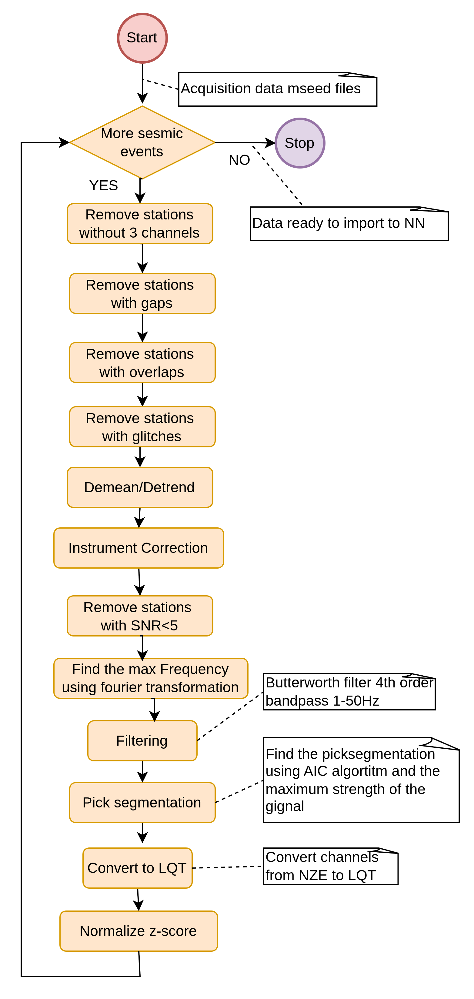

# 📘 Pre-Processing Repository

## Complete Activity Diagram


## Pre-Processing


## Installation

### Installation Prerequisites

Conda should be installed and data should be acquired using Data_Acquisition project

### Clone the Repository
```bash
git clone https://github.com/iarvanitis69/phd_preprocessing.git
cd phd_preprocessing
```

### Activate Basic Conda Commands

1. Change directory
```bash
cd phd_preprocessing
```

2. Activate Conda environment
```bash
   conda activate phd_cond_env_p10
```
---

## Execute Preprocessing
```base
python main.py
```

## Pre-processing tasks
The preprocessing pipeline consists of a series of distinct procedures, each designed to transform and enhance the raw seismic waveform data. The primary goal of this stage is to produce the cleanest and most representative signal possible, ensuring that the resulting waveform is optimally prepared for input into the neural network model known as GreensonNet.

### useOnlyStationsWith3Channels.py
The first step in the preprocessing pipeline is the execution of the function "Use Only Stations with Three Channels". This function iterates through the entire directory of all seismic events, checking each station within every event to verify whether it contains all three seismic components (typically HHE, HHN, and HHZ). If a station is found to have fewer than three channels — that is, only one or two — it is removed from the event. If, after this filtering, an event is left with no remaining valid stations, the entire event directory is deleted.

### gaps.py
The second step in the preprocessing sequence involves detecting data gaps. This is handled by the script gaps.py, specifically by the function named find_files_for_gaps(). This function scans all downloaded waveform files to identify any that contain missing data segments (gaps). During our analysis, we observed that none of the downloaded files contained any data gaps, indicating high integrity in the acquired waveforms.

### overlaps.py
The next step in the preprocessing pipeline is the removal of overlapping waveform segments. Fortunately, no overlaps were found in the downloaded signals. As a result, all waveform files were retained and used in full, with no data being discarded at this stage.

### glitches.py
The function FindGlitches scans all waveform files for the presence of glitches. A small number of glitches were detected — specifically, five seismic traces in total. The corresponding stations containing these traces were removed from the dataset to ensure data quality.

### demean_detrend.py
The next step involves applying demeaning and detrending to all seismic signals. This preprocessing was performed on each waveform, resulting in the creation of new MiniSEED files with the filename extension _demean_detrend.mseed, indicating that both the mean and linear trend were removed from the original data.

### Instrument correction
The following step is instrument correction, which removes the instrument’s response imperfections from each waveform. This process was applied to all signals. Starting from the previously preprocessed files named _demean_detrend.mseed, a new set of files was generated with the suffix _demean_detrend_IC.mseed, where ic stands for Instrument Correction.

### snr.py
Next, all seismic waveforms with a signal-to-noise ratio (SNR) less than 5 are removed. Importantly, if even one channel from a station is discarded, the entire station is removed as well. Furthermore, if no stations remain for a given event after this filtering step, the entire event folder is also deleted. This ensures that only high-quality, noise-free seismic data is retained for further processing.

### fourier_transformation.py
At this stage, using the Find, Meet, and Max Frequency function, we compute the Power Spectral Density (PSD) of each seismic signal and determine the lower and upper cutoff frequencies, defined as the frequencies below which 5% and 95% of the signal's total energy reside, respectively.
In addition, this function generates a visual output (a PNG image) containing both the Fourier Transform of the signal and the PSD (Welch method) plot. These visuals clearly mark the computed cutoff frequencies, providing an intuitive understanding of the signal’s frequency content.
We observe that some signals have a maximum cutoff frequency reaching 50 Hz, while the minimum cutoff frequency can drop below 0.1 Hz.

### filtering.py
We do not apply any upper cutoff filter, since the signals already have a natural limit at 50 Hz due to the Nyquist theorem, given that the sampling rate is 100 Hz.
On the other hand, for the low-frequency end, we apply a high-pass filter at 1 Hz, in order to remove unwanted low-frequency noise and long-period artifacts.
The filtering step takes as input the *_dmean_detrend_IC.mseed files and produces the filtered output files named *_dmean_detrend_IC_filtered.mseed.

### peak_segmentation.py
The next step is to determine the peak segmentation of the signal. To achieve this, we first identify the onset point of the seismic wave using the Akaike Information Criterion (AIC) algorithm, and then locate the peak, defined as the absolute maximum amplitude of the signal.
We then measure the time duration between the onset and the peak, and extend the window by the same duration beyond the peak, until the signal starts to decay.
This extracted segment represents the most energetic and noise-free part of the waveform and is the one used in GreensonNet, since only a strong, clean signal can provide reliable information for estimating the Green’s Function.
The peak segmentation step takes as input the *_dmean_detrend_IC_filtered.mseed files and produces as output the *_dmean_detrend_IC_filtered_PS.mseed files.

### convert_to_LQT.py
The nextstep of the preprocessing pipeline is the transformation from the NZE coordinate system to the LQT coordinate system.
In this transformation, the L-axis is defined as the axis pointing from the epicenter of the earthquake to the respective seismic station.
The input to this step is the file:*_demean_detrend_IC_filtered_PS.mseed and the output is the transformed file:*_demean_detrend_IC_filtered_PS_LQT.mseed

### z_score_normalization.py
The final step of the preprocessing pipeline is Z-score normalization.At this stage, we take the LQT-transformed signal—specifically, the file: *_dmean_dtrend_IC_filtered_PS_LQT.mseed
and we produce the final normalized output: *_demean_detrend_IC_filtered_PS_Lqt_zscore.mseed. This normalized signal is the final version used for visual inspection before being fed into the GreensonNet neural network.
 
## The final folder tree
After pre-processing the folder of each chanel should be the following 

