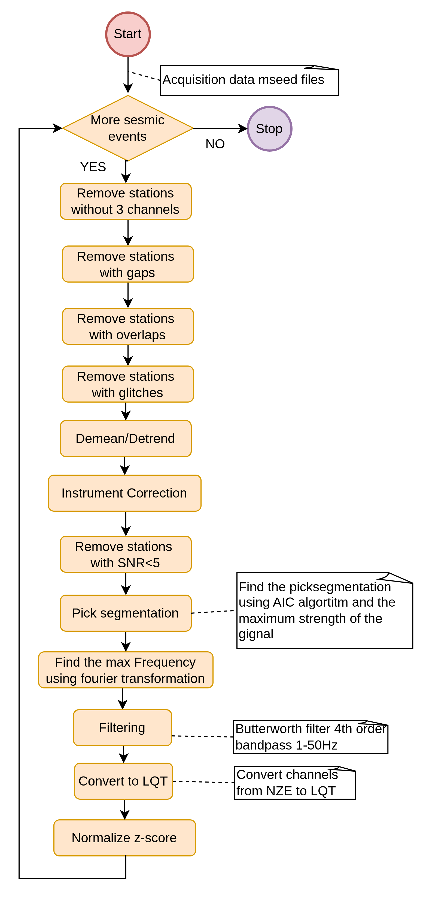

# 📘 Pre-Processing Repository
This repository contains the code for pre-prosessing.
---
## 🧩 Complete Activity Diagram


## 🧩 Pre-Processing


## 🧩 Installation

### Install Miniconda on Windows/Linux
The following procedure should be executed only once. If you already have installed Conda don't do it again

#### Windows

1. **Download the latest Miniconda installer**:  
   [Miniconda3 Windows 64-bit](https://repo.anaconda.com/miniconda/Miniconda3-latest-Windows-x86_64.exe)

2. **Run the `.exe` file as Administrator**.

3. Choose:
   - Installation type: **Just Me**
   - **Add Miniconda to PATH** (optional but useful)

4. **Complete the installation**.

5. Open **Anaconda Prompt** or **Command Prompt**, and test:
```bash
   conda --version
```

#### Linux

1. Download the latest installer for Linux:
```bash
   wget https://repo.anaconda.com/miniconda/Miniconda3-latest-Linux-x86_64.sh
```
2. Run the installer:
```bash
   bash Miniconda3-latest-Linux-x86_64.sh
```
   Follow the on-screen instructions (press Enter, accept license, choose install location, etc).

3. After installation, run:
```bash
   source ~/.bashrc
   conda --version
```

### Clone the Repository
```bash
git clone https://github.com/iarvanitis69/phd_preprocessing.git
cd phd_preprocessing
```

### Activate Basic Conda Commands

1. Change directory
```bash
cd phd_preprocessing
```
2. Install Conda environment/depenndencies
```bash
   conda env create -f environment.yml 
````
3. Activate Conda environment
```bash
   conda activate phd_cond_env_p10
```
---

## Event Base Execution

### Run the DataAcquisition Project
```bash
cd phd_preprocessing
python main.py 
```

**Example:**
The following command performs pre-processing ao all events
```bash
python main 
```


