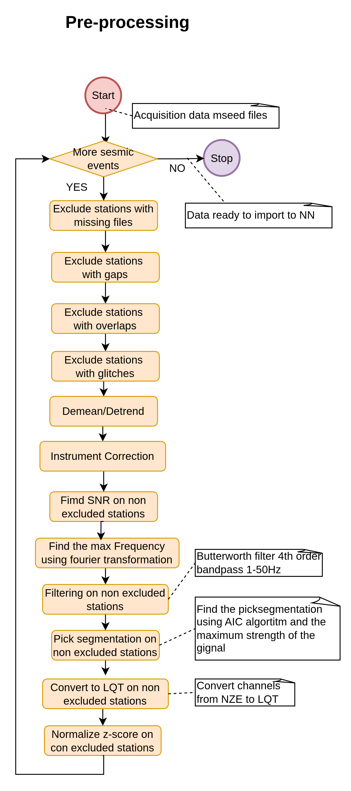
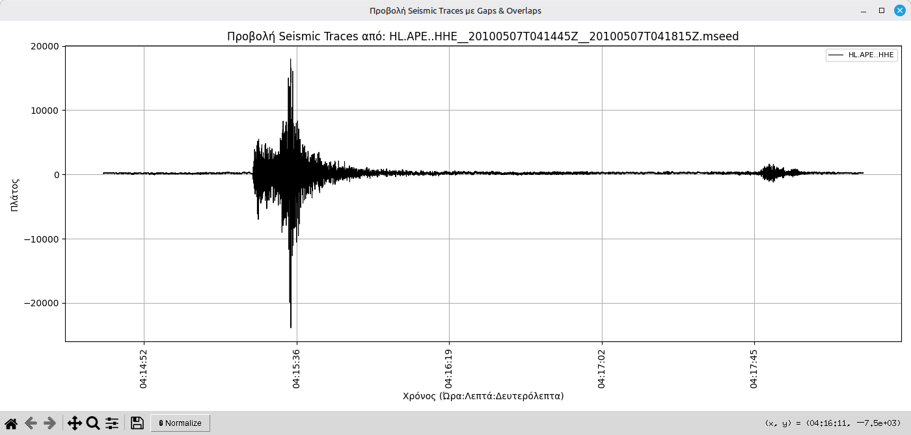
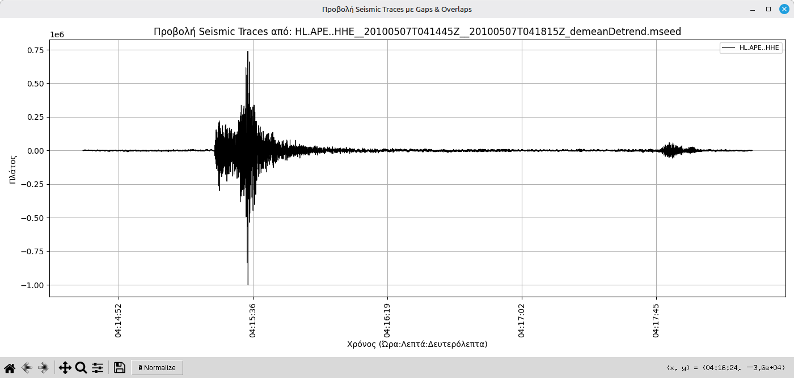
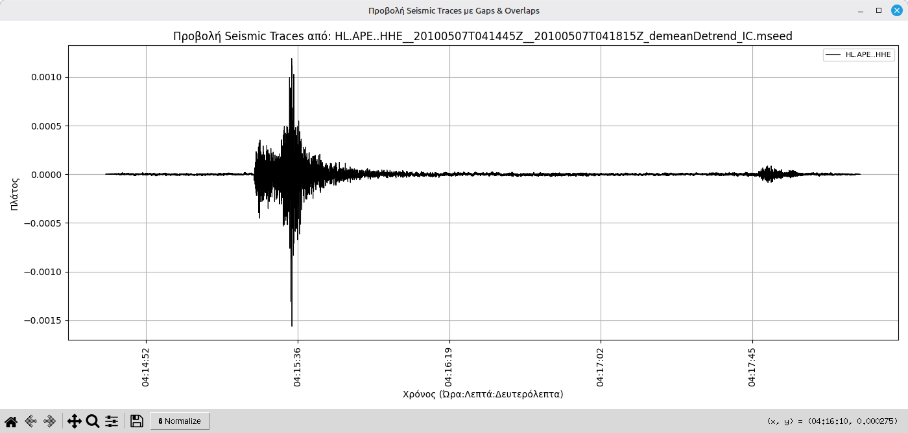
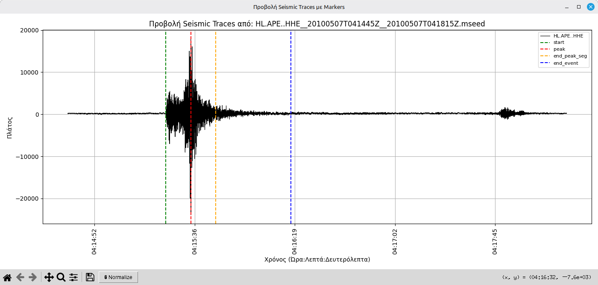
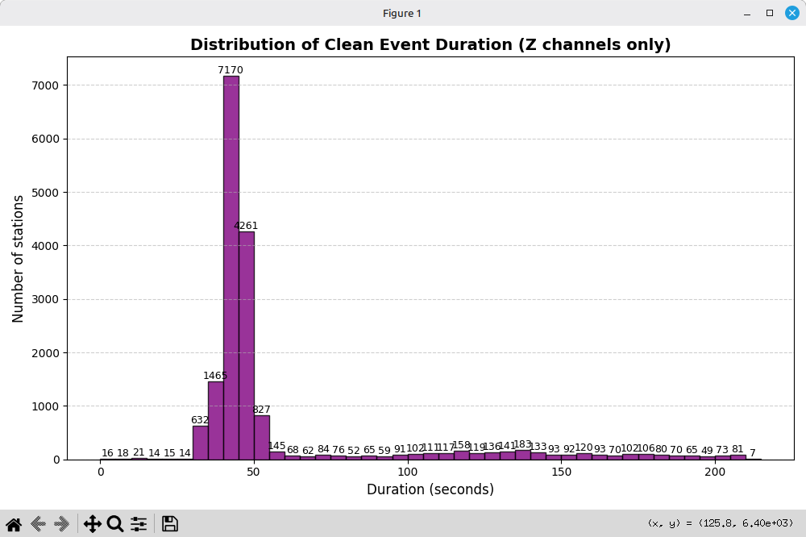
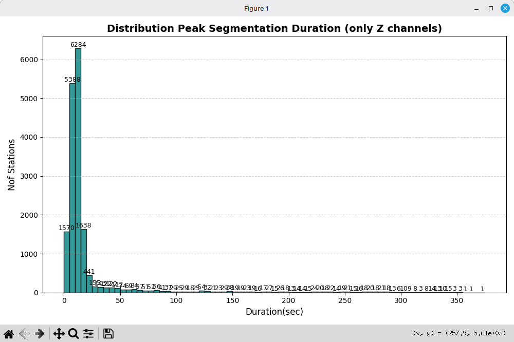
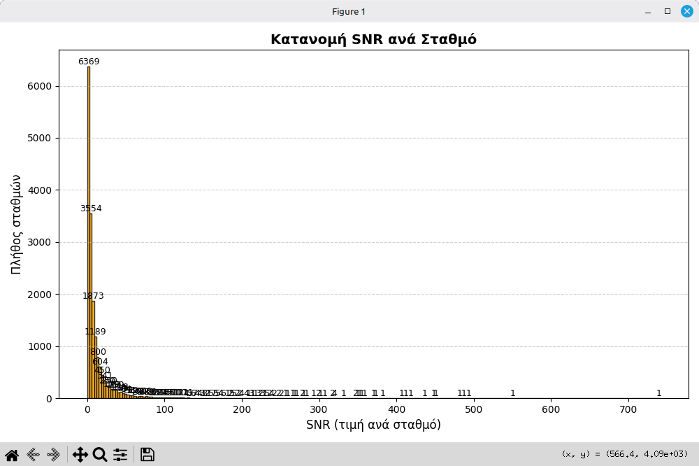
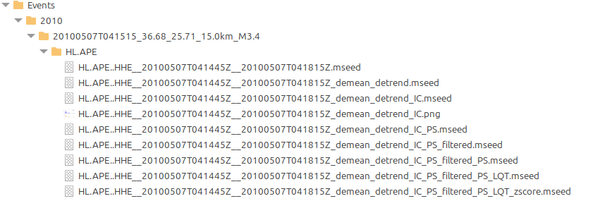

# 📘 Pre-Processing Repository

## Complete Activity Diagram


## Pre-Processing


## Installation

### Installation Prerequisites

Conda should be installed and data should be acquired using Data_Acquisition project

### Clone the Repository
```bash
git clone https://github.com/iarvanitis69/phd_preprocessing.git
cd phd_preprocessing
```

### Activate Basic Conda Commands

1. Change directory
```bash
cd phd_preprocessing
```

2. Activate Conda environment
```bash
   conda activate phd_cond_env_p10
```
---

## Execute Preprocessing
```base
python main.py
```

## Pre-processing tasks
The preprocessing pipeline consists of a series of distinct procedures, each designed to transform and enhance the raw 
seismic waveform data. The primary goal of this stage is to produce the cleanest and most representative signal possible, 
ensuring that the resulting waveform is optimally prepared for input into the neural network model known as GreensonNet.

### missingFiles.py
In the file missingfiles.py, we use the function find_stations_with_issues().
This function identifies:
Stations that have fewer than three channels, and Stations that are missing the StationXML file, which contains the 
metadata describing the station.
If either of these issues is detected, the event and station details are: Logged into the file missingfiles.json, and 
Added to the excluded-others-for-stations.json file for exclusion from further processing.

The structure of the file excluded_stations.json includes the key COUNT, which indicates the total number of excluded 
stations. Additionally, for each excluded station, the corresponding event is listed as a key, and directly under it, 
the specific station(s) that have been excluded from that event are recorded.

```excluded_statios.json
{
  "COUNT": 15,
  "20110408T235106_36.63_25.66_10.0km_M3.4": {
    "HT.CMBO": {
      "reason": "channels lower than 3"
    }
  },
  "20111212T225036_36.41_25.42_5.7km_M3.0": {
    "HT.CMBO": {
      "reason": "channels lower than 3"
    }
  },
  ...
}
```
The structure of missingfiles.json is similar. Specifically, it contains the event, the station that has the issue, 
and the reason for the problem. The reason can be either “channels lower than 3” or “missing StationXML file.”

``` missing_files.json
{
  "20110408T235106_36.63_25.66_10.0km_M3.4": {
    "HT.CMBO": {
      "reason": "channels lower than 3"
    }
  },
  "20111212T225036_36.41_25.42_5.7km_M3.0": {
    "HT.CMBO": {
      "reason": "channels lower than 3"
    }
  },
  ...
}
```
  
### gaps.py
The logic for detecting GAPs and Overlaps is exactly the same. If any GAPs or Overlaps are found, they are recorded in 
the respective files: gaps.json and overlaps.json, and the corresponding stations are also marked as excluded.
However, in practice, no files were found to contain any GAPs or Overlaps, so nothing was added to the excluded files, 
and both gaps.json and overlaps.json remain empty.

### overlaps.py
See above. No files were found to contain any GAPs or Overlaps, so nothing was added to the excluded files, 
and both gaps.json and overlaps.json remain empty.

### glitches.py
The file glitches.py calls the function find_glitches, which scans for glitches across all channels, stations, and events.
If a glitch is detected, it is recorded in the file glitches.json, and the corresponding station is also marked as 
excluded, using the same logic applied in previous cases (e.g., missingfiles.json, excluded-others-for-stations.json).
Although in principle minor glitches could be handled via interpolation, in this case we had a large number of signals 
and the glitches appeared in only a few cases — specifically, only 8 channels.
Therefore, to simplify the process, we completely ignore those signals: they are excluded via excluded__stations.json, 
and not used at all in any further processing or analysis.

The structure of the glitches.json file is organized as follows:
At the top level, it contains the event name.Under each event, it lists the corresponding network and station.
Beneath that, it includes each affected channel.For every channel, it reports:
The number of glitches detected in the corresponding .mseed file (post_count).
An array of glitch entries, where each glitch entry contains:

```
1) start_index and end_index: the index range where the glitch occurs.
2) channel: the affected channel name (repeated for clarity).
3) station and network: inherited from the parent structure but also repeated in each glitch entry.
4) start_time and end_time: the time interval of the glitch.
5) peak_rise: the steep upward jump between two consecutive samples.
6) peak_fall: the steep drop in the two samples that follow.
7) filename: the name of the .mseed file that was analyzed.
```

The peak_rise and peak_fall values represent how abrupt the change is between consecutive samples — the rise between 
sample 1 and 2, and the fall between sample 3 and 4. A glitch is identified when these differences exceed a certain 
threshold (typically greater than or equal to 1 in magnitude).

``` glitches.json
{
  "20250204T134403_36.65_25.60_14.4km_M3.3": {
    "HL.AMGA": {
      "HHZ": {
        "count": 1,
        "glitches": [
          {
            "start_index": 612,
            "end_index": 616,
            "channel": "HHZ",
            "station": "AMGA",
            "network": "HL",
            "start_time": "2025-02-04T13:43:33.630000Z",
            "end_time": "2025-02-04T13:43:33.670000Z",
            "peak_rise": 1.6,
            "peak_fall": -1.3283,
            "file": "HL.AMGA..HHZ__20250204T134333Z__20250204T134703Z.mseed"
          }
        ]
      }
    }
  },
  "20250213T165000_36.69_25.67_1.0km_M3.1": {
    "HT.AKRO": {
      "HHN": {
        "count": 1,
        "glitches": [
          {
            "start_index": 8465,
            "end_index": 8469,
            "channel": "HHN",
            "station": "AKRO",
            "network": "HT",
            "start_time": "2025-02-13T16:50:53.480000Z",
            "end_time": "2025-02-13T16:50:53.520000Z",
            "peak_rise": 1.3106,
            "peak_fall": -1.3411,
            "file": "HT.AKRO..HHN__20250213T164930Z__20250213T165300Z.mseed"
          }
        ]
      }
    }
  },
  ...
}
```  

### demean_detrend.py
The next step involves applying demeaning and detrending to all seismic signals. This preprocessing was performed on 
each waveform, resulting in the creation of new MiniSEED files with the filename extension _demeanDetrend.mseed, 
indicating that both the mean and linear trend were removed from the original data.

#### Downloaded Signal


#### Demean/Detrend signal


### instrument_correction.py
The following step is instrument correction, which removes the instrument’s response imperfections from each waveform. 
This process was applied to all signals. Starting from the previously preprocessed files named _demean_detrend.mseed, 
a new set of files was generated with the suffix _demean_detrend_IC.mseed, where ic stands for Instrument Correction.

#### Instrument correction Signal


### snr.py

The fumction findSnr() creates the file snr.json. This file stores the Signal-to-Noise Ratio (SNR) values for each 
seismic event, each station, and each channel.

#### How SNR is calculated

The SNR is computed using three time windows from the waveform:
Edge Start Window: The first 30 seconds of the signal (PRESET_SEC), before the seismic wave arrives.
Middle Window: The central portion of the signal that contains the actual seismic wave.
Edge End Window: The final 30 seconds (END_SEC) of the signal, after the main event.
For each channel, the following values are extracted:

 - edge_max: The maximum absolute amplitude in the edge windows (start + end).
 - middle_max: The maximum absolute amplitude in the middle window (the event).
 - snr: The ratio middle_max / edge_max, representing the signal-to-noise level of the channel.

For each station, the field:
 - minimum_snr: is computed as the minimum SNR value among the three main channels: HHE, HHN, and HHZ, only if all 
   three exist.

This file contains the Signal-to-Noise Ratio (SNR) values computed for every event, station, and channel, using 
well-defined signal segments.

Keys in the JSON file

    - COUNT_OF_STATIONS An integer that represents the total number of unique stations for which the SNR was 
                        successfully calculated.

    - Events A nested structure organized as: Events → Year → Event Name → Station → Channel

### SNR Calculation Logic

Each waveform is divided into three time windows:
Start Window (edge_start) – the first 30 seconds of the waveform.
Middle Window (middle) – the part of the waveform that contains the actual seismic signal.
End Window (edge_end) – the last 30 seconds of the waveform.

For each channel, we compute:

 - first_max: Maximum absolute amplitude in the start window
 - last_max: Maximum absolute amplitude in the end window
 - middle_max: Maximum absolute amplitude in the middle window
 - edge_max: The larger of first_max and last_max
 - snr: Calculated as: snr = middle_max / max(first_max, last_max)

##### Station-Level SNR (minimum_snr)

Once SNR values have been computed for all three channels (HHE, HHN, HHZ) of a station:
The field minimum_snr is added to the station entry.
It represents the minimum SNR across the three channels:
minimum_snr = min(snr_HHE, snr_HHN, snr_HHZ)

This field provides a conservative estimate of the station’s signal quality.
``` snr.json
{
  "COUNT_OF_STATIONS": 17000,
  "Events": {
    "2010": {
      "20100507T041515_36.68_25.71_15.0km_M3.4": {
        "HL.APE": {
          "HHE": {
            "edge_max": 8.758102922001854e-05,
            "middle_max": 0.0015626093372702599,
            "first_max": 1.7794573068385944e-05,
            "last_max": 8.758102922001854e-05,
            "snr": 17.84186979012142,
            "total_duration": 215.18
          },
          "HHN": {
            "edge_max": 0.00017686319188214839,
            "middle_max": 0.0015632888535037637,
            "first_max": 1.9251423509558663e-05,
            "last_max": 0.00017686319188214839,
            "snr": 8.83897224758037,
            "total_duration": 213.59
          },
          "HHZ": {
            "edge_max": 0.00010352303070249036,
            "middle_max": 0.0016127951676025987,
            "first_max": 3.356333036208525e-05,
            "last_max": 0.00010352303070249036,
            "snr": 15.579095212720679,
            "total_duration": 215.26
          },
          "minimum_snr": 8.83897224758037
        },
        ...
      }  
  }
}
```

### fourier_transformation.py


### filtering.py
Regarding filtering, we conducted a Fourier Transformation and computed the Power Spectral Density (PSD) using the Welch 
method for all non-excluded stations. This PSD diagram revealed both the upper and lower cutoff frequencies, defined 
respectively by the 95% and 5% energy thresholds.
From these values, we observed that some signals exhibit very high upper cutoff frequencies, approaching 50 Hz. Since 
our sampling rate is 100 Hz, we concluded that applying an upper cutoff filter is unnecessary, as it would provide no 
additional benefit.
On the other hand, the minimum cutoff frequencies were found to be very low. However, frequencies below 1 Hz are likely 
of anthropogenic origin. Therefore, we decided to filter them out using a fourth-order Butterworth filter with a lower 
cutoff frequency set to 1 Hz. The function filter_all_files() takes as input the files *_demeanDetrend_IC.mseed files and
provides as output the files *_demeanDetrend_IC_BPF.mseed file

### boundaries.py

### boundaries

The next step is to determine the peak segmentation of the HHZ signal using the function find_boundaries().
To achieve this, we first identify the onset of the seismic wave using the Akaike Information Criterion (AIC) algorithm.
Once the onset point is located, we determine the peak of the signal, defined as the absolute maximum amplitude of the 
Hilbert envelope. We then measure the time interval between the onset and the peak and extend the time window by the 
same duration beyond the peak, until the signal begins to decay. This extracted segment represents the most energetic 
and noise-free portion of the waveform and is the segment used in GreensonNet, since only strong and clean signals can 
provide reliable information for estimating the Green’s Function.

In more detail, the find_boundaries() function estimates the following parameters:
(1) the onset of the seismic wave,
(2) the time and index of its maximum amplitude,
(3) the end of the peak segment, and
(4) the end of the seismic event.

The signal is first processed with a 4th-order Butterworth band-pass filter, and the Hilbert transform is then applied 
to the filtered waveform. The peak of the signal corresponds to the maximum of the resulting Hilbert envelope. The end 
of the event signal is defined as the point where the envelope amplitude drops below the estimated noise level of the 
HHZ channel.
After identifying the peak, the algorithm continues to scan the Hilbert envelope forward in time. As the seismic energy 
gradually decays, the envelope eventually reaches the noise floor. The moment at which the envelope first falls below 
this noise threshold is defined as the end of the seismic event.
All computed parameters are systematically recorded in a JSON file, enabling subsequent analysis and providing a 
consistent dataset for downstream processing pipelines such as GreensonNet.

``` boundaries.json
{
  "total_nof_stations": 44,
  "2010": {
    "20100507T041515_36.68_25.71_15.0km_M3.4": {
      "HL.APE": {
        "HHZ": {
          "start_of_event_idx": 4204,
          "start_of_event_datetime": "2010-05-07T04:15:23.550000Z",
          "peak_amplitude_idx": 5284,
          "peak_amplitude_datetime": "2010-05-07T04:15:34.350000Z",
          "peak_amplitude": 0.52197,
          "end_of_peak_segment_idx": 6364,
          "end_of_peak_segment_datetime": "2010-05-07T04:15:45.150000Z",
          "peak_segment_duration_nof_samples": 2160,
          "peak_segment_duration_time": "21.60",
          "end_of_event_idx": 9604,
          "end_of_event_time": "2010-05-07T04:16:17.550000Z",
          "event_duration_nof_samples": 5400,
          "event_duration_time": "54.00",
          "total_signal_nof_samples": 21526,
          "total_signal_time": "215.26"
        },
        "minimum_station_snr": 8.839
      },
      ...
    }
  }
}    
```

| Field Name       | Type    | Description |
|------------------|---------|-------------|
| YEAR             | String  | Top-level key grouping all events that occurred in the same year (e.g., "2010"). |
| EVENT_ID         | String  | Unique event identifier containing origin time, latitude, longitude, depth, and magnitude (e.g., "20100507T041515_36.68_25.71_15.0km_M3.4"). |
| STATION_CODE     | String  | Seismic station identifier in the form NETWORK.STATION (e.g., "HL.APE"). |
| CHANNEL_CODE     | String  | Channel identifier, usually HHZ, HHN, HHE (or EHZ/BHZ equivalents). Each channel contains its own segmentation fields. |
| minimum_station_snr | Float | Minimum SNR among the three channels (HHZ/HHN/HHE) for that station. Added once per station, not per channel. |


| Field Name                         | Type    | Description |
|------------------------------------|---------|-------------|
| total_nof_stations                 | Integer | Total number of stations processed and included in the file. |
| start_of_event_idx                 | Integer | Sample index where the AIC picker detected the onset of the seismic event. |
| start_of_event_datetime            | String  | UTC timestamp of the event onset (AIC-derived). |
| peak_amplitude_idx                 | Integer | Sample index of the strongest peak in the Hilbert envelope after the event onset. |
| peak_amplitude_datetime            | String  | UTC timestamp of the strongest peak. |
| peak_amplitude                     | Float   | Normalized amplitude (0–1 scale) of the strongest peak. |
| end_of_peak_segment_idx            | Integer | Sample index marking the end of the peak segment window (symmetric around the peak). |
| end_of_peak_segment_datetime       | String  | UTC timestamp of the end of the peak segment. |
| peak_segment_duration_nof_samples  | Integer | Number of samples in the peak segmentation window. |
| peak_segment_duration_time         | String  | Duration of the peak segmentation window in seconds. |
| end_of_event_idx                   | Integer | Sample index where the Hilbert envelope energy drops back to the noise level (SNR-based). |
| end_of_event_time                  | String  | UTC timestamp marking the end of the clean event signal. |
| event_duration_nof_samples         | Integer | Duration of the clean event in samples (AIC → SNR-based end). |
| event_duration_time                | String  | Duration of the clean event in seconds. |
| total_signal_nof_samples           | Integer | Total number of samples in the raw waveform (.mseed trace). |
| total_signal_time                  | String  | Total duration of the full waveform in seconds. |
| minimum_station_snr                | Float   | Minimum SNR among HHZ/HHN/HHE channels for the station. |



After computing the segmentation boundaries for all stations, the next step is to analyze the distribution of the 
extracted parameters.
In the first stage, we generate the distribution — specifically, the histogram — of the Clean Event Duration Time for 
all stations. This allows us to identify whether there are stations whose clean event duration falls below a certain 
threshold, which determines whether they are eligible for inclusion in the Training Set.



We compute the scatter plot of the peak segmentation duration in order to visualize where the peak segment predominantly 
lies across all stations. This plot provides an overview of how long the strongest part of the signal lasts and whether 
the peak segment durations cluster around specific values.



Next, we compute the SNR distribution, based on the minimum SNR value of each station. By generating the corresponding 
scatter or histogram plot, we can observe how the SNR varies among the stations and whether certain stations 
consistently exhibit lower or higher signal quality. This visualization helps assess the reliability and robustness of 
the dataset before it is used in downstream processing.



These diagnostic plots serve as an important quality-control step, ensuring that the seismic signals exhibit consistent 
behaviour and that all stations meet the required signal-to-noise thresholds.

### AIC failure
In some seismic recordings, the waveform morphology is such that the AIC (Akaike Information Criterion) algorithm fails 
to detect a reliable onset time. This typically occurs in cases where the signal begins too gradually, contains complex 
emergent energy, or is dominated by noise in the early portion of the trace. When the AIC picker is unable to estimate 
the start of the seismic event, the trace cannot be processed further for peak segmentation.
All events for which the AIC algorithm fails are recorded in a dedicated JSON file named AIC_failure.json. Each failure 
is stored following the hierarchy:

``` AIC_failure.json
{
  "count:10
  "2024": {
    "20240531T081538_36.68_25.77_11.3km_M3.2": {
      "HL.SANT"
    },
    ...
```

Additionally, the file maintains a top-level counter (count) that tracks the total number of stations where AIC onset 
detection was unsuccessful. This mechanism ensures that problematic waveforms are systematically tracked, the 
preprocessing pipeline remains robust when restarting or resuming execution and AIC failures can be reviewed later for 
diagnostic or quality-control purposes.


In the second stage, the function create_peak_segmentation() files is executed, which takes as input the 
*_dmean_detrend_IC_BPF.mseed files and produces as output the *_dmean_detrend_IC_BPF_PS.mseed files.

### The used stations on training (training set)
The function COUNT NOF TRAINING STATIONS determines the final number of stations that will be used in the Training Set.
This function classifies each station based on three criteria:

 - the Minimum SNR,
 - the Maximum Peak Segment Duration, and
 - the Minimum Clean Event Duration.

Using these thresholds, the function decides which seismic signals are suitable for inclusion in the Training Set.


📊 *** SIGNAL CLASSIFICATION REPORT ***
⚠ NOT USED SET : SNR ≥ 5 & PS_duration_time > 30 sec : 594
⚠ NOT USED SET : SNR < 5 : 9025
⚠ NOT USED SET : SNR ≥ 5 & clean_event_duration_time < 30 sec : 1
------------------------------------------------------------------------------------------------------------
✔ TRAINING SET : SNR ≥ 5 & PS_duration_time ≤ 30 sec & clean_event_duration_time ≥ 30 sec : 7836


### convert_ΝΖΕ_to_LQT.py
The nextstep of the preprocessing pipeline is the transformation from the NZE coordinate system to the LQT coordinate 
system.
In this transformation, the L-axis is defined as the axis pointing from the epicenter of the earthquake to the 
respective seismic station. The input to this step is the file:*_demean_detrend_IC_filtered_PS.mseed and the output is 
the transformed file:*_demean_detrend_IC_filtered_PS_LQT.mseed

### z_score_normalization.py
The final step of the preprocessing pipeline is Z-score normalization.At this stage, we take the 
LQT-transformed signal—specifically, the file: *_dmean_dtrend_IC_filtered_PS_LQT.mseed and we produce the final 
normalized output: *_demean_detrend_IC_filtered_PS_Lqt_zscore.mseed. This normalized signal is the final version used 
for visual inspection before being fed into the GreensonNet neural network.
 
## The final folder tree
After pre-processing the folder of each channel should be like the following 



## The log files
- [missing_files.json](./Logs/instrumentCorrection_errors.json)
- [gaps.json](./Logs/instrumentCorrection_errors.json)
- [overlaps.json](./Logs/instrumentCorrection_errors.json)
- [glitches.json](./Logs/instrumentCorrection_errors.json)
- [snr.json](./Logs/snr.json)
- [instrumentCorrection_errors.json](./Logs/instrumentCorrection_errors.json)
